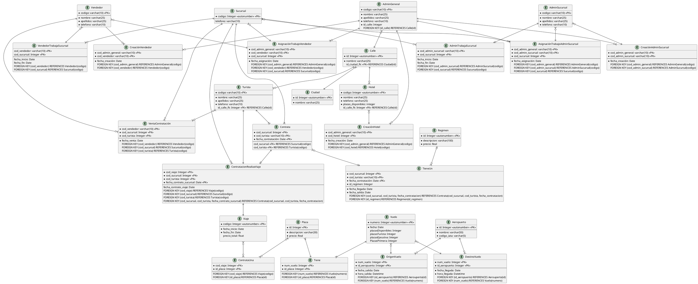

## Agencia de viajes Relational Model

``` plantuml
@startuml
entity Turista {
    * codigo: varchar(10) <<PK>>
    --
    * nombre: varchar(25)
    * apellidos: varchar(25)
    * telefono: varchar(10)
    id_calle_fk: Integer <<FK>> REFERENCES Calle(id)
}

/' Relación: Turista contrata sucursal '/
entity Contrata {
    * cod_sucursal: Integer <<PK>>
    * cod_turista: varchar(10) <<PK>>
    * fecha_contratación: Date <<PK>> /'Permite que un turista contrate la misma sucursal en diferentes contrataciones en diferentes fechas'/
    --
    cod_sucursal <<FK>> REFERENCES Sucursal(codigo)
    cod_turista <<FK>> REFERENCES Turista(codigo)
}

entity ContratacionRealizaViaje {
    * cod_viaje: Integer <<PK>>
    * cod_sucursal: Integer <<PK>>
    * cod_turista: Integer <<PK>>
    * fecha_contrato_sucursal: Date <<PK>>
    --
    fecha_contrato_viaje: Date
    FOREIGN KEY (cod_viaje) REFERENCES Viaje(codigo)
    FOREIGN KEY (cod_sucursal) REFERENCES Sucursal(codigo)
    FOREIGN KEY (cod_turista) REFERENCES Turista(codigo)
    FOREIGN KEY (cod_sucursal, cod_turista, fecha_contrato_sucursal) REFERENCES Contrata(cod_sucursal, cod_turista, fecha_contratacion)
}

entity Vendedor {
    * codigo: varchar(10) <<PK>>
    --
    * nombre: varchar(25)
    * apellidos: varchar(25)
    * telefono: varchar(10)
}

entity VentaContratación {
    * cod_vendedor: varchar(10) <<PK>>
    * cod_sucursal: Integer <<PK>>
    * cod_turista: Integer <<PK>>
    --
    * fecha_venta: Date
    FOREIGN KEY (cod_vendedor) REFERENCES Vendedor(codigo)
    FOREIGN KEY (cod_sucursal) REFERENCES Sucursal(codigo)
    FOREIGN KEY (cod_turista) REFERENCES Turista(codigo)
}

entity VendedorTrabajaSucursal {
    cod_vendedor: varchar(10) <<PK>>
    cod_sucursal: Integer <<PK>>
    --
    fecha_inicio: Date
    fecha_fin: Date
    FOREIGN KEY (cod_vendedor) REFERENCES Vendedor(codigo)
    FOREIGN KEY (cod_sucursal) REFERENCES Sucursal(codigo)
}

entity AdminSucursal {
    * codigo: varchar(10) <<PK>>
    --
    * nombre: varchar(25)
    * apellidos: varchar(25)
    * telefono: varchar(10)
}

entity AdminTrabajaSucursal {
    * cod_admin_sucursal: varchar(10) <<PK>>
    * cod_sucursal: Integer <<PK>>
    --
    fecha_inicio: Date
    fecha_fin: Date
    FOREIGN KEY (cod_admin_sucursal) REFERENCES AdminSucursal(codigo)
    FOREIGN KEY (cod_sucursal) REFERENCES Sucursal(codigo)
}

entity AdminGeneral {
    * codigo: varchar(10) <<PK>>
    --
    * nombre: varchar(25)
    * apellidos: varchar(25)
    * telefono: varchar(10)
    * id_calle: Integer
    FOREIGN KEY (id_calle) REFERENCES Calle(id)
}

entity CreaciónVendedor {
    * cod_admin_general: varchar(10) <<PK>>
    * cod_vendedor: varchar(10) <<PK>>
    --
    * fecha_creación: Date
    FOREIGN KEY (cod_admin_general) REFERENCES AdminGeneral(codigo)
    FOREIGN KEY (cod_vendedor) REFERENCES Vendedor(codigo)
}

entity AsignaciónTrabajoVendedor {
    * cod_admin_general: varchar(10) <<PK>>
    * cod_vendedor: varchar(10) <<PK>>
    * cod_sucursal: Integer <<PK>>
    --
    * fecha_asignación: Date
    FOREIGN KEY (cod_admin_general) REFERENCES AdminGeneral(codigo)
    FOREIGN KEY (cod_vendedor) REFERENCES Vendedor(codigo)
    FOREIGN KEY (cod_sucursal) REFERENCES Sucursal(codigo)
}

entity CreaciónAdminSucursal {
    * cod_admin_general: varchar(10) <<PK>>
    * cod_admin_sucursal: varchar(10) <<PK>>
    --
    * fecha_creación: Date
    FOREIGN KEY (cod_admin_general) REFERENCES AdminGeneral(codigo)
    FOREIGN KEY (cod_admin_sucursal) REFERENCES AdminSucursal(codigo)
}

entity AsignaciónTrabajoAdminSucursal {
    * cod_admin_general: varchar(10) <<PK>>
    * cod_admin_sucursal: varchar(10) <<PK>>
    * cod_sucursal: Integer <<PK>>
    --
    * fecha_asignación: Date
    FOREIGN KEY (cod_admin_general) REFERENCES AdminGeneral(codigo)
    FOREIGN KEY (cod_admin_sucursal) REFERENCES AdminSucursal(codigo)
    FOREIGN KEY (cod_sucursal) REFERENCES Sucursal(codigo)
}

entity CreaciónHotel {
    * cod_admin_general: varchar(10) <<PK>>
    * cod_hotel: Integer <<PK>>
    --
    * fecha_creación: Date
    FOREIGN KEY (cod_admin_general) REFERENCES AdminGeneral(codigo)
    FOREIGN KEY (cod_hotel) REFERENCES Hotel(codigo)
}

entity Vuelo {
    * numero: Integer <<autonumber>> <<PK>>
    --
    * fecha: Date
    plazasDisponibles: Integer
    plazasTurista: Integer
    plazasEjecutiva: Integer
    PlazasPrimera: Integer
}

entity Aeropuerto {
    * id: Integer <<autonumber>> <<PK>>
    --
    * nombre: varchar(50)
    * codigo_iata: varchar(5)
}

entity OrigenVuelo {
    * num_vuelo: Integer <<PK>>
    * id_aeropuerto: Integer <<PK>>
    --
    * fecha_salida: Date
    * hora_salida: Datetime
    FOREIGN KEY (id_aeropuerto) REFERENCES Aerouperto(id)
    FOREIGN KEY (num_vuelo) REFERENCES Vuelo(numero)
}

entity DestinoVuelo {
    * num_vuelo: Integer <<PK>>
    * id_aeropuerto: Integer <<PK>>
    --
    * fecha_llegada: Date
    * hora_llegada: Datetime
    FOREIGN KEY (id_aeropuerto) REFERENCES Aerouperto(id)
    FOREIGN KEY (num_vuelo) REFERENCES Vuelo(numero)
}

entity Viaje {
    * codigo: Integer <<autonumber>> <<PK>>
    --
    * fecha_inicio: Date
    * fecha_fin: Date
    precio_total: float
    
}

entity Calle {
    * id: Integer <<autonumber>> <<PK>>
    --
    * nombre: varchar(25)
    id_ciudad_fk: <<FK>> REFERENCES Ciudad(id)
}

entity Ciudad {
    * id: Integer <<autonumber>> <<PK>>
    --
    * nombre: varchar(25)
}

entity Hotel {
    * codigo: Integer <<autonumber>> <<PK>>
    --
    * nombre: varchar(25)
    * telefono: varchar(25)
    * plazas_disponibles: integer
    id_calle_fk: Integer <<FK>> REFERENCES Calle(id)
}

entity Sucursal {
    * codigo: Integer <<autonumber>> <<PK>>
    --
    telefono: varchar(10)
}

entity Regimen {
    * id: Integer <<autonumber>> <<PK>>
    --
    * descripcion: varchar(100)
    * precio: Real   
}

entity TieneUn {
    * cod_sucursal: Integer <<PK>>
    * cod_turista: varchar(10) <<PK>>
    * fecha_contratación: Date <<PK>> 
    * id_regimen: Integer
    --
    * fecha_llegada: Date
    * fecha_salida: Date
    FOREIGN KEY (cod_sucursal, cod_turista, fecha_contratacion) REFERENCES Contrata(cod_sucursal, cod_turista, fecha_contratacion)
    FOREIGN KEY (id_regimen) REFERENCES Regimen(id_regimen)
}

entity Plaza {
    * id: Integer <<PK>>
    --
    * descripcion: varchar(30)
    * precio: Real
}

entity Tiene {
    * num_vuelo: Integer <<PK>>
    * id_plaza: Integer <<PK>>
    --
    FOREIGN KEY (num_vuelo) REFERENCES Vuelo(numero)
    FOREIGN KEY (id_plaza) REFERENCES Plaza(id)
}

entity ContrataUna {
    * cod_viaje: Integer <<PK>>
    * id_plaza: Integer <<PK>>
    --
    FOREIGN KEY (cod_viaje) REFERENCES Viaje(codigo)
    FOREIGN KEY (id_plaza) REFERENCES Plaza(id)
}

/' Relaciones '/
Turista ||--|{ Contrata
Sucursal ||--|{ Contrata
Calle ||--o{ Turista
Calle }|--|| Ciudad
Calle ||--o{ Hotel
ContratacionRealizaViaje ||--|| Viaje
Vendedor ||--o{ VentaContratación
Vendedor }o--|| VendedorTrabajaSucursal
AdminSucursal ||--o| AdminTrabajaSucursal
AdminGeneral }o--|| Calle
AdminGeneral ||--o{ CreaciónVendedor
AdminGeneral ||--o{ AsignaciónTrabajoVendedor
AdminGeneral ||--o{ CreaciónAdminSucursal
AdminGeneral ||--o{ AsignaciónTrabajoAdminSucursal
AdminGeneral ||--o{ CreaciónHotel
Vuelo }o--|| OrigenVuelo
Vuelo }o--|| DestinoVuelo
Aeropuerto ||--o{ OrigenVuelo
Aeropuerto ||--o{ DestinoVuelo
Turista }o--o{ VentaContratación
Sucursal ||--o{ VentaContratación
Sucursal ||--o{ VendedorTrabajaSucursal
Sucursal ||--o{ AdminTrabajaSucursal
Vendedor --o{ CreaciónVendedor
Vendedor }o--|| AsignaciónTrabajoVendedor
Sucursal }o--|| AsignaciónTrabajoVendedor
AdminSucursal }o--|| CreaciónAdminSucursal
AdminSucursal }o--|| AsignaciónTrabajoAdminSucursal
Sucursal }o--|| AsignaciónTrabajoAdminSucursal
Hotel }o--|| CreaciónHotel
Sucursal ||--o{ ContratacionRealizaViaje
Turista ||--|| ContratacionRealizaViaje
Contrata ||--o| ContratacionRealizaViaje
Contrata }o--o| TieneUn
Regimen |o--o{ TieneUn
Viaje }o--o{ ContrataUna
Plaza }o--o{ ContrataUna
Vuelo ||--|{ Tiene
Plaza }|--|| Tiene
@endluml
```

